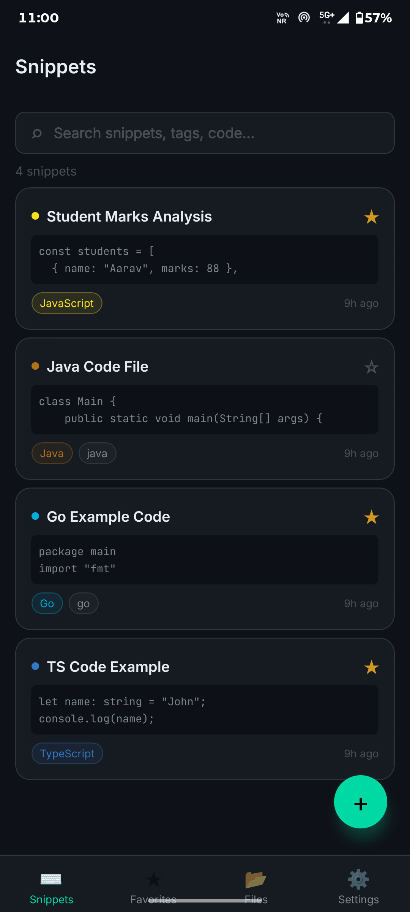
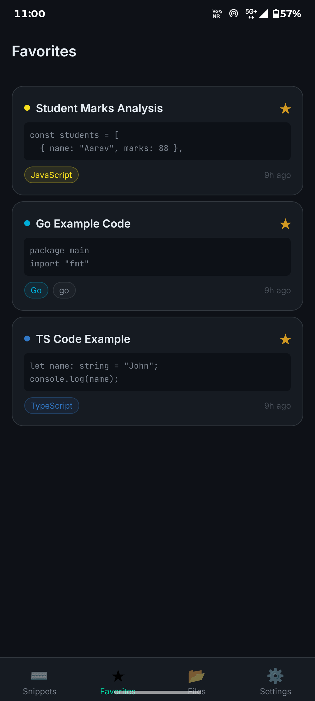
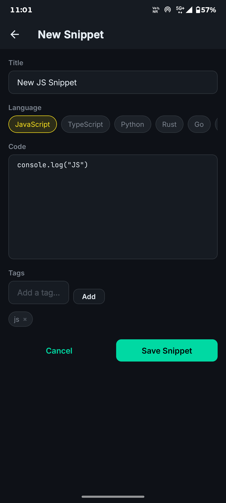
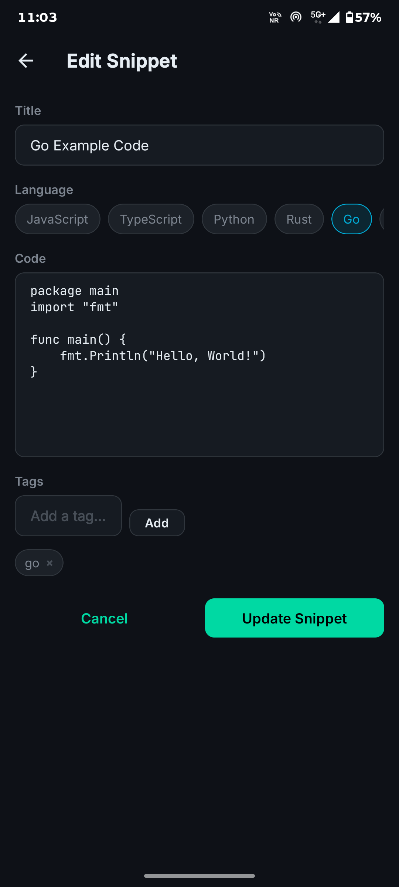
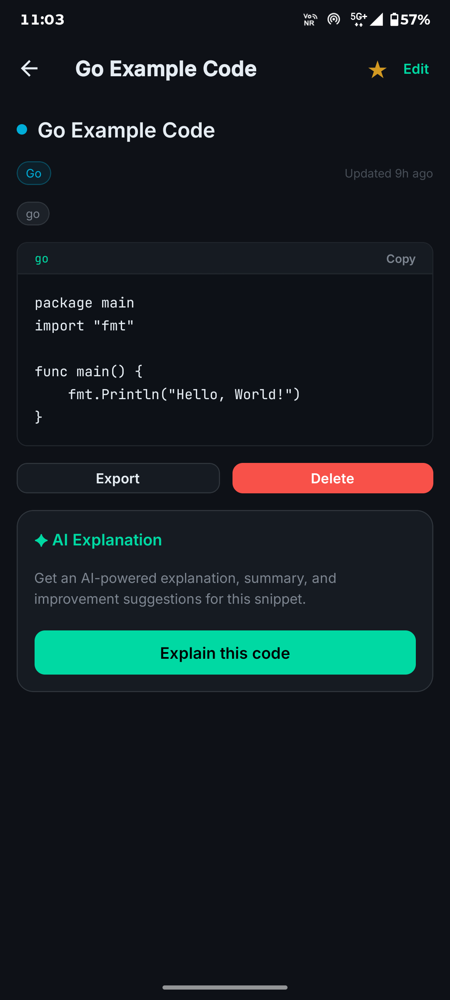
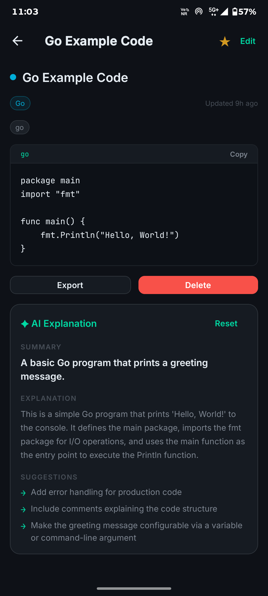
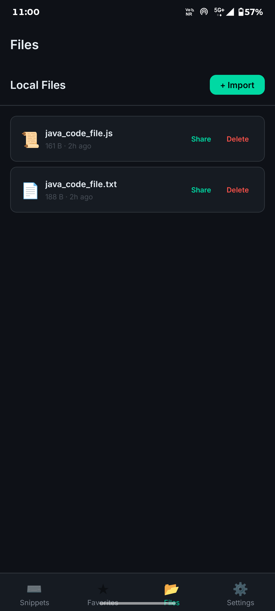
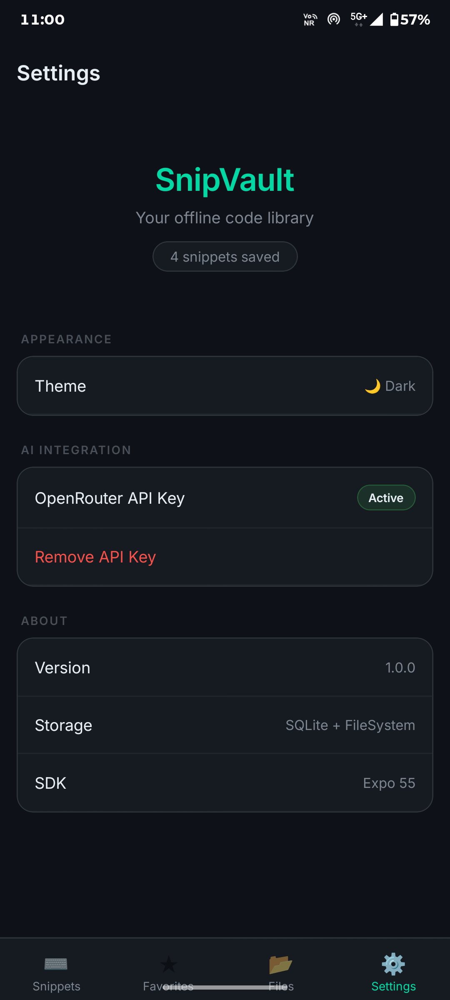

# SnipVault

An offline-first code snippet manager for developers

## Demo

[Watch the demo on YouTube](https://www.youtube.com/shorts/GQBHpAcrC5Q)

## Screenshots

## Features

- Create, edit, delete, and search code snippets
- Full-text search powered by SQLite FTS5
- Mark snippets as favorites
- AI-powered code explanations, summaries, and improvement suggestions
- Export snippets as .txt, .js, or .json files
- Native share sheet integration
- Local file manager with import, delete, and share
- Offline-first, all core features work without internet
- Dark and light theme with persistent preference
- Secure API key storage using SecureStore

## Tech Stack

| Technology | Purpose |
| --- | --- |
| Expo SDK 55 | Core framework |
| React Native | Mobile UI |
| TypeScript | Type safety |
| Expo Router | File-based navigation |
| SQLite | Local snippet database |
| AsyncStorage | Theme and preference storage |
| SecureStore | Encrypted API key storage |
| expo-file-system | Local file management |
| Zustand | Global state management |
| FlashList | Performant list rendering |

## Architecture

### Database Structure

The app uses SQLite with two tables: snippets and files. The snippets 
table stores title, code, language, tags as a JSON string, favorite 
status, and timestamps. A virtual FTS5 table enables full-text search 
across title, code, and tags. Three triggers keep the FTS index in sync 
with inserts, updates, and deletes.

### Offline Storage Approach

All core data lives on-device in SQLite. AsyncStorage holds lightweight 
preferences like theme mode. SecureStore holds the AI API key using 
device-level encryption. The app boots and runs fully without any 
network connection. Internet is only required for the optional AI 
explanation feature.

### File Management Implementation

File management uses the expo-file-system SDK 55 API, specifically the 
File and Directory classes from expo-file-system/next. Files are 
stored in a dedicated snipvault_files directory inside the app document 
directory. Users can import any file via the document picker, browse 
stored files, share them via the native share sheet, or delete them.

### AI Integration Workflow

The AI feature is intentionally optional and network-gated. The user 
adds an OpenRouter API key once in Settings, which is stored securely via 
SecureStore and never hardcoded. When the user requests an explanation, 
the app sends the code and language to gpt-4o-mini and parses a 
structured JSON response containing an explanation, summary, and 
improvement suggestions. If there is no network or no key, the UI shows 
a clear error state rather than crashing.